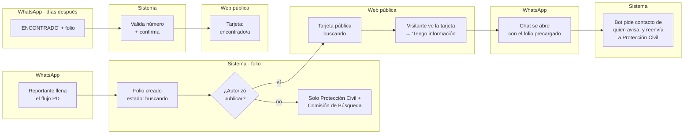
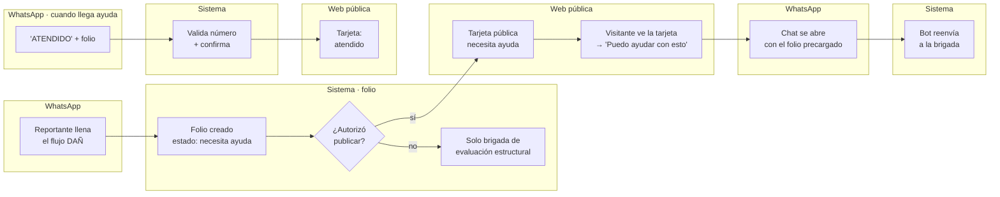
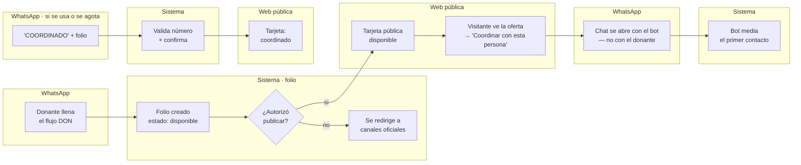

# Circuitos ciudadanos: WhatsApp → Web

Diseño de los tres flujos de **Línea Sismo** que capturan un reporte por WhatsApp y lo vuelven visible en una web pública de solo lectura — persona no localizada, ayuda con daños, y ofertas de donación.

**Estado:** borrador de diseño, salido de una sesión de co-diseño el 15 de agosto de 2026. Todavía no se construye — es la referencia para cuando se arme.

**Contexto:** esto extiende [`docs/ONBOARDING.md`](ONBOARDING.md) y la propuesta de `linea-sismo.html`. Centinela (alertas sísmicas) y Línea Sismo (reportes ciudadanos) comparten el mismo canal — WhatsApp captura, la web solo muestra.

## El patrón: un folio, dos canales

Los tres circuitos comparten el mismo mecanismo:

1. **Captura en WhatsApp.** La persona llena un flujo guiado (listas y botones, casi nada de texto libre) y el sistema crea un folio.
2. **¿Autoriza publicar?** El sistema pregunta si el reporte puede aparecer en la web pública. Si no autoriza, el dato igual llega a la institución que corresponda — solo que no se vuelve público.
3. **Vitrina en la web.** Tarjeta de solo lectura: lo esencial del reporte, el folio, y un botón de acción que **siempre vuelve a abrir WhatsApp** — nunca hay un formulario nuevo en la web.
4. **Resolución en WhatsApp.** El caso se cierra desde el mismo canal donde se abrió, y el sistema valida que sea el mismo número el que lo cierra.

Nada se escribe directo en la web. Es un canal de salida, no de entrada.

---

## Circuito 1 — Persona no localizada (PD)

El más sensible de los tres: nombre, foto y últimos datos conocidos de alguien.



### A · Captura en WhatsApp

| # | Paso | Nota |
|---|---|---|
| 1 | Menú → "🔍 Persona no localizada" | Ya existe en `linea-sismo.html` |
| 2 | Bot explica destino antes de pedir datos: "esto llega a Protección Civil y Comisión de Búsqueda" | Ya existe |
| 3 | Nombre completo de la persona | Ya existe |
| 4 | Últimos datos conocidos (cuándo/dónde, ubicación opcional) | Ya existe |
| 5 | **Si el nombre o la zona ya tienen un reporte similar, el bot lo muestra antes de seguir** | Contador de duplicados — mismo patrón que ya usa `SIS` ("se sumó a 214 reportes en tu zona") |
| 6 | Foto opcional | Ya existe |
| 7 | **"¿Autorizas publicar este reporte en la web pública, para que otros ayuden a buscar? Si dices que no, solo llega a las instituciones."** Sí / No | Opt-in explícito |
| 8 | Nombre y relación de quien reporta | Para que la institución sepa a quién contactar |
| 9 | Folio + confirmación. Si autorizó: "también quedó visible en [link web]" | — |

### B · Vitrina web

Tarjeta por persona: foto (o silueta si no autorizó foto), nombre, última ubicación conocida, fecha/hora, folio, estado (**buscando** / **encontrado**). Botón **"Tengo información"** → abre WhatsApp con el folio precargado — el bot pide un mínimo de contacto a quien avisa antes de reenviar el aviso a instituciones.

### C · Cuando alguien aporta información

```
Vos · tengo información PD-240815-0417

Centinela · Gracias por escribir. Contame qué sabés y cómo te
podemos contactar — se lo paso a Protección Civil y a la
Comisión de Búsqueda.

Vos · La vi ayer en la tarde en el hospital San Francisco, de Quibdó

Centinela · Listo, se lo pasé a Protección Civil. Te contactan si
necesitan algo más.
```

### D · Resolución

| # | Paso |
|---|---|
| 1 | Quien reportó escribe: *"ENCONTRADO PD-240815-0417"* |
| 2 | El bot valida que el número coincide con quien abrió ese folio — si no: *"Este folio no es tuyo. Si tenés información, escribí 'tengo información' o contactá a Protección Civil."* |
| 3 | Confirma antes de cambiar nada: *"¿Confirmas que María fue encontrada?"* |
| 4 | Estado pasa a **encontrado/a** en la web + se notifica a las instituciones |
| — | **Si fue un error, quien cerró el folio puede reabrirlo** escribiendo *"REABRIR PD-..."*, con la misma validación de número |

---

## Circuito 2 — Ayuda y daños (DAÑ)

**RES (rescate con riesgo de vida) queda fuera de la vitrina pública.** Ya notifica en paralelo al equipo de rescate y a la línea de emergencia (123). Publicar la ubicación exacta de alguien atrapado suma riesgo, no seguridad — no aporta nada que el equipo de rescate no tenga ya. Lo que sí se vuelve público es **DAÑ**: alguien reporta su casa o negocio afectado, y qué necesita mientras llega la brigada.



### A · Captura en WhatsApp

| # | Paso | Nota |
|---|---|---|
| 1 | Menú → "🏚️ Reportar daños" | Ya existe |
| 2 | Ubicación | Ya existe |
| 3 | 1–2 fotos del daño | Ya existe |
| 4 | Nivel de riesgo (habitable / riesgo, evacuamos / no estoy seguro) | Ya existe |
| 5 | **"¿Qué necesitás mientras llega la brigada?"** — lista corta: cuadrilla de evaluación · agua y alimentos · un lugar dónde dormir · nada, solo registrarlo | Abre la puerta a que alguien ajeno a la brigada oficial pueda ayudar antes |
| 6 | **"¿Autorizás que esto aparezca en la web, para que una organización pueda ofrecer ayuda directa mientras llega la brigada?"** Sí/No | Mismo opt-in que en PD |
| 7 | Folio + confirmación → brigada de evaluación estructural + (si autorizó) la web | — |

### B · Vitrina web

Tarjeta: ubicación, nivel de riesgo (misma codificación de color que "buscando/encontrado"), qué necesita, folio, estado (**necesita ayuda** / **atendido**), foto si fue autorizada. Botón **"Puedo ayudar con esto"** → abre WhatsApp con el folio precargado.

### C · Cuando alguien ofrece ayuda

```
Vos · puedo ayudar DAÑ-240815-0512

Centinela · Gracias por escribir. Contame qué podés ofrecer y cómo
te contactamos — se lo paso a la brigada de evaluación estructural,
que coordina la ayuda en la zona.

Vos · Tengo un carro y puedo llevar agua, 3011234567

Centinela · Listo, se lo pasé a la brigada. Te contactan si tu
ayuda encaja con lo que necesitan ahí.
```

### D · Resolución

| # | Paso |
|---|---|
| 1 | Quien reportó (o la brigada, una vez llega) escribe: *"ATENDIDO DAÑ-240815-0512"* |
| 2 | El bot valida el número — si no coincide: *"Este folio no es tuyo. Si podés ayudar, escribí 'puedo ayudar' o contactá a la brigada de evaluación estructural."* |
| 3 | Confirma antes de cambiar nada: *"¿Confirmás que ya te atendió la brigada?"* |
| 4 | Estado pasa a **atendido** en la web |
| — | **Si fue un error**, se reabre escribiendo *"REABRIR DAÑ-..."*, con la misma validación de número |

---

## Circuito 3 — Donaciones (DON)

**"Donar dinero" no cambia** — sigue siendo puro redirect a canales oficiales verificados, sin capturar ni publicar nada (la regla que ya tiene Centinela: *"el bot nunca dicta un número de cuenta"*). Lo nuevo es un circuito paralelo para quien ofrece **víveres, tiempo o espacio** — eso sí se puede volver una oferta visible.

**El contacto de quien dona nunca se muestra en la tarjeta.** El botón de la web abre WhatsApp hacia el *bot*, no hacia el número del donante — el bot hace de puente en el primer contacto, mismo criterio de protección de datos que en PD.



### A · Captura en WhatsApp

| # | Paso | Nota |
|---|---|---|
| 1 | Menú → "❤️ Donar o ser voluntario/a" | Ya existe |
| 1a | Si elige **"Donar dinero"** → flujo actual sin cambios | Redirect a canales oficiales, advertencia antifraude |
| 1b | Si elige víveres/insumos, voluntariado o albergue → circuito nuevo | — |
| 2 | **"¿Qué ofrecés, específicamente?"** — texto corto (ej. *"20 kits de aseo"*, *"tengo camioneta"*, *"2 cupos de albergue"*) | Reemplaza la lista genérica por un dato accionable |
| 3 | Zona o municipio donde puede entregarlo | Para filtrar la vitrina por cercanía |
| 4 | **"¿Autorizás publicar esta oferta en la web para que una organización te contacte?"** Sí/No | Si dice que no, se lo redirige a los canales oficiales en vez de publicarlo |
| 5 | Folio + confirmación | — |

> **Si elige "Donar dinero"** (1a): *"Para donar dinero, hacelo directo en el canal oficial de [organización], nunca por acá. [link]"* seguido de *"⚠️ Centinela nunca pide ni entrega números de cuenta por WhatsApp."*

### B · Vitrina web

Tarjeta: qué ofrece, zona, folio, estado (**disponible** / **coordinado**) — sin contacto visible. Botón **"Coordinar con esta persona"** → abre WhatsApp con el folio precargado, el mensaje llega al *bot*, que arma el puente.

### C · Cuando alguien quiere coordinar

```
Vos · quiero coordinar DON-240815-0618

Centinela · Le aviso a quien ofreció esto. Dejame tu nombre y
cómo te puede contactar.

Vos · Ana Gómez, 3001234567

Centinela · (al donante) Alguien quiere coordinar tu oferta
(DON-240815-0618): Ana Gómez, 3001234567. Podés escribirle
directo o seguir coordinando por acá.
```

### D · Resolución

| # | Paso |
|---|---|
| 1 | El donante escribe: *"COORDINADO DON-240815-0618"* o *"YA NO DISPONIBLE DON-240815-0618"* |
| 2 | El bot valida el número — si no coincide: *"Este folio no es tuyo. Si querés coordinar, escribí 'quiero coordinar' o contactá a la organización."* |
| 3 | Confirma antes de cambiar nada: *"¿Confirmás que ya coordinaste la entrega?"* |
| 4 | Estado pasa a **coordinado** en la web (o se retira la oferta) |
| — | **Si fue un error**, se reabre escribiendo *"REABRIR DON-..."*, con la misma validación de número |

---

## Ejemplo de referencia (Circuito PD)

```
Vos · reporto a alguien no localizado

Centinela · Vamos a registrar a una persona no localizada.
Nombre completo:

Vos · María Elena Rodríguez Paz

Centinela · ¿Cuándo y dónde la viste por última vez?

Vos · Hoy como a las 8am, salía de su casa en el barrio Kennedy, Quibdó

Centinela · ¿Autorizas que este reporte —nombre, foto y última
ubicación— aparezca en la web pública para que otros ayuden a buscar?

Vos · Sí, publícalo

Centinela · ¿Tu nombre y qué relación tenés con ella?

Vos · Carlos Rodríguez, soy su hermano

Centinela · Folio PD-240815-0417. Enviado a Protección Civil y a la
Comisión de Búsqueda. También quedó visible en la web.
```

En la web pública aparece la tarjeta con estado **buscando**. Cuando Carlos escribe *"ENCONTRADO PD-240815-0417"* y confirma, la tarjeta pasa a **encontrado/a**.

---

## Decisiones de diseño

| Tema | Decisión | Por qué |
|---|---|---|
| Privacidad (PD) | Opt-in explícito, dentro del mismo flujo | Nadie aparece en la web sin que quien reporta lo decida a propósito |
| Verificación | Tiempo real, sin filtro institucional | Sale a la web apenas se envía por WhatsApp — riesgo aceptado: reportes falsos o duplicados quedan visibles hasta que alguien los cierre |
| Resolución | Solo quien reportó puede cerrar el caso | El bot valida que el número que escribe "ENCONTRADO"/"ATENDIDO"/"COORDINADO" es el mismo que abrió el folio |
| Reabrir | Quien cerró el folio puede reabrirlo | Mismo mecanismo de validación por número, con "REABRIR + folio" |
| Duplicados (PD) | Contador de reportes similares | Mismo patrón que ya usa `SIS`: mostrarlo antes de publicar, no bloquear |
| Contacto de quien avisa (PD) | Se pide un mínimo (nombre + cómo responderle) | Para que la institución pueda darle seguimiento |
| Alcance (Ayuda) | RES queda fuera de la vitrina pública | Ya notifica en paralelo al 123; publicar la ubicación de alguien atrapado suma riesgo, no seguridad |
| Dinero (Donaciones) | Sin cambios: redirect puro a canales oficiales | Regla ya existente de Centinela — el bot nunca dicta un número de cuenta |
| Contacto (Donaciones) | El bot media, la tarjeta no muestra el número | Mismo criterio de protección de datos que en PD |
| Vitrinas (Donaciones) | Ofertas individuales y acopios institucionales (`src/ingesta.js`), en secciones separadas | No se mezcla un dato institucional ya verificado con una oferta suelta de una persona |
| Mensaje "folio no es tuyo" | Misma estructura en los tres circuitos, cambia solo el verbo de acción y la institución | Reconocible como el mensaje de error de folios sin importar el circuito |

## Siguiente paso

Diseñar la página web que junta las tres vitrinas — cómo se navega entre Desaparecidos / Ayuda / Donaciones, si es una sola página con filtros o secciones separadas, y qué se ve primero.

## Referencia visual

Hay una versión interactiva de estos tres diagramas armada en un [Claude Artifact](https://claude.ai/code/artifact/1241dfed-7590-4477-9ecc-a18490edf03d) — es privada por defecto, hay que compartirla desde el menú de la página para que el equipo la vea.
