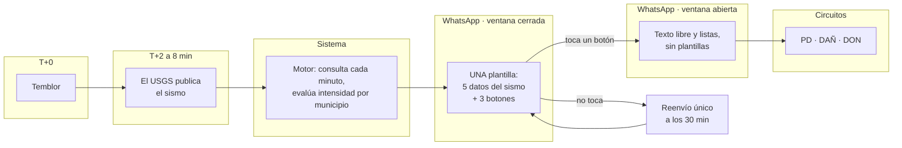

# La entrada: del temblor a los tres circuitos

Cómo llega alguien a reportar. Nadie abre un menú por su cuenta — el bot va
primero, después del sismo, y la respuesta a ese mensaje es la que abre la
puerta.

**Estado:** diseño cerrado, listo para construir. Extiende
[`docs/CIRCUITOS.md`](CIRCUITOS.md) (PR #13), que arranca justo donde este
documento termina: en los menús *¿Qué necesitás?* y *Formas de ayudar*.

---

## La restricción que le da forma a todo

WhatsApp parte el mundo en dos según quién habló último:

| Se puede | Ventana de 24 h abierta<br>*la persona escribió o tocó un botón* | Ventana cerrada<br>*el bot inicia* |
|---|---|---|
| Texto libre | sí | **no** |
| Botones (hasta 3, 20 caracteres) | sí | solo los que la plantilla ya trae aprobados |
| Listas (hasta 10 filas) | sí | **no existen en plantillas** |
| Costo | una conversación de servicio | una plantilla **por envío** |
| Aprobación previa | ninguna | cada plantilla, por Meta |

Todo el flujo de entrada ocurre con la ventana **cerrada**: el bot habla
primero. Ahí no hay texto libre ni listas, y cada mensaje cuesta una plantilla
aprobada.

De ahí sale la decisión central: **tocar un botón de la plantilla abre la
ventana**. Por eso la plantilla lleva los botones puestos — es la única forma
de que alguien abra la ventana sin tener que escribir, justo cuando lo último
que quiere hacer es escribir.

---

## El flujo



### 1 · Suscripción

| # | Paso | Nota |
|---|---|---|
| 1 | La persona le escribe al bot | — |
| 2 | El bot pide **la ciudad**, de la lista de 10 municipios | Ya existe, en `workflows/onboarding/definition.json` |
| 3 | «Te avisaré cuando haya un temblor» | Ya existe |

Es el único dato de la suscripción. No se pide el nombre: la ciudad es lo que
hace funcionar la alerta, porque `evaluarAlerta()` calcula la intensidad en ese
municipio y con eso decide a quién escribirle.

Después de esto puede pasar cualquier cosa — días, semanas.

### 2 · Cuando tiembla

```
T+0        el sismo ocurre
T+2 a 8    el USGS lo publica
+1 min     el motor lo detecta (poll cada minuto)      ← ya existe
```

Ese retraso no depende de nosotros, y es la razón de que el check-in no pueda
contarse en segundos desde el temblor: a los 30 segundos todavía no existe el
dato del que sale la alerta.

Entonces sale **un solo envío**, con la ventana cerrada — la plantilla
`alerta_sismica` con sus cinco variables (magnitud, epicentro, hora,
profundidad, intensidad) **más tres botones de respuesta rápida**:

```
🔴 SISMO

Magnitud 5.1
Epicentro: 18 km al SE de Quibdó, Chocó
Hora: 2:14:07 p. m.
Profundidad: 32 km
En tu zona se sintió: moderado

¿Cómo te encontrás en este momento?

[ Necesito ayuda ]  [ Quiero ayudar ]  [ Estoy bien ]
```

El check-in viaja **dentro** de la alerta en vez de ser un segundo envío. A 30
segundos de distancia los dos mensajes llegan prácticamente juntos: separarlos
no le da tiempo a nadie, y sí cuesta otra plantilla, otra aprobación y otro
impacto en la calificación de calidad del número.

`Estoy bien` existe para cerrar el caso sin ocupar a nadie, y para sacar a esa
persona de los reenvíos.

### 3 · Con la ventana abierta

Tocar cualquiera de los tres botones abre la ventana de 24 h. De ahí en
adelante el bot conversa libre, con listas de hasta 10 filas y sin costo por
mensaje.

| Botón | Lleva a | Ya existe |
|---|---|---|
| **Necesito ayuda** | *¿Qué necesitás?* → 🔍 Persona no localizada (**PD**) · 🏚️ Reportar daños (**DAÑ**) · 🐕 Mascota · 🛏 Dónde dormir · 💵 Ayuda económica | `menu_necesito` |
| **Quiero ayudar** | *Formas de ayudar* → ❤️ Donar o ser voluntario (**DON**) · 📦 Llevar cosas · 🩸 Donar sangre · 🏠 Ofrecer alojamiento | `menu_ayudar` |
| **Estoy bien** | «Me alegra. Si algo cambia, escribime por acá.» | — |

Las dos puertas ya están en `workflows/ayuda/definition.json`. Lo único que
cambia es quién las abre: hoy la persona, acá el bot después del temblor.

### 4 · Si no toca ningún botón

| # | Paso |
|---|---|
| 1 | **+30 min** — se reenvía la misma plantilla, **una sola vez** |
| 2 | Después se cierra sin novedad |
| — | La persona puede escribir cuando quiera y entra por el menú de siempre — eso ya funciona hoy |

Un solo reenvío, no dos. Cada reenvío con la ventana cerrada es otra plantilla
a alguien que puede estar perfectamente bien: el segundo aporta poco y sí
desgasta la calificación de calidad del número, que es lo que decide cuántos
mensajes deja mandar Meta.

---

## Decisiones de diseño

| Tema | Decisión | Por qué |
|---|---|---|
| Dato de suscripción | Solo la ciudad | Es el que hace funcionar la alerta: `evaluarAlerta()` calcula la intensidad en ese municipio |
| Alerta sísmica | Los cinco datos de siempre, sin cambios | Ya está aprobada y funcionando |
| Momento del check-in | Dentro de la alerta, como botones | A 30 s de distancia llegan juntos: separarlos cuesta una plantilla más y no da tiempo a nadie |
| Contar los 30 s desde el temblor | Descartado | El USGS tarda de 2 a 8 minutos; a los 30 s no existe el dato |
| Tercera opción | `Estoy bien` | Cierra el caso y saca a la persona de los reenvíos |
| Reenvíos | Uno, a los 30 min | El segundo aporta poco y desgasta la calificación de calidad del número |
| Después del reenvío | Se cierra sin novedad | La persona sigue pudiendo escribir por su cuenta |

---

## Antes de construir

1. **Rehacer `alerta_sismica` con los tres botones** y mandarla a
   re-aprobación de Meta. Es trabajo previo, no un bloqueo del diseño.
2. **Confirmar en el WhatsApp Manager** con qué categoría queda aprobada y
   cuál es el límite de envíos del número. Esas reglas las mueve Meta y
   cambian; no darlas por sabidas.
3. **Filtrar el check-in por intensidad.** `evaluarAlerta()` ya la calcula por
   municipio. Usar el mismo umbral evita preguntarle «¿estás bien?» a quien
   sintió *leve*.
4. **Agrupar réplicas.** `clasificarReplicas()` ya existe. El ciclo va por
   episodio sísmico, no por cada evento que publica el USGS — si no, una
   secuencia de réplicas dispara diez ciclos de check-in sobre la misma gente.
